# Exno:1
Data Cleaning Process

# AIM
To read the given data and perform data cleaning and save the cleaned data to a file.

# Explanation
Data cleaning is the process of preparing data for analysis by removing or modifying data that is incorrect ,incompleted , irrelevant , duplicated or improperly formatted. Data cleaning is not simply about erasing data ,but rather finding a way to maximize datasets accuracy without necessarily deleting the information.

# Algorithm
STEP 1: Read the given Data

STEP 2: Get the information about the data

STEP 3: Remove the null values from the data

STEP 4: Save the Clean data to the file

STEP 5: Remove outliers using IQR

STEP 6: Use zscore of to remove outliers
## CODING AND OUTPUT:
```py

            Developed by: SHREYAS SIVAN
            Regno: 212221080075
```
## 1) Read and display DataFrame
```py
import pandas as pd
df=pd.read_csv('/content/SAMPLEDS.csv')
df
```
## OUTPUT:
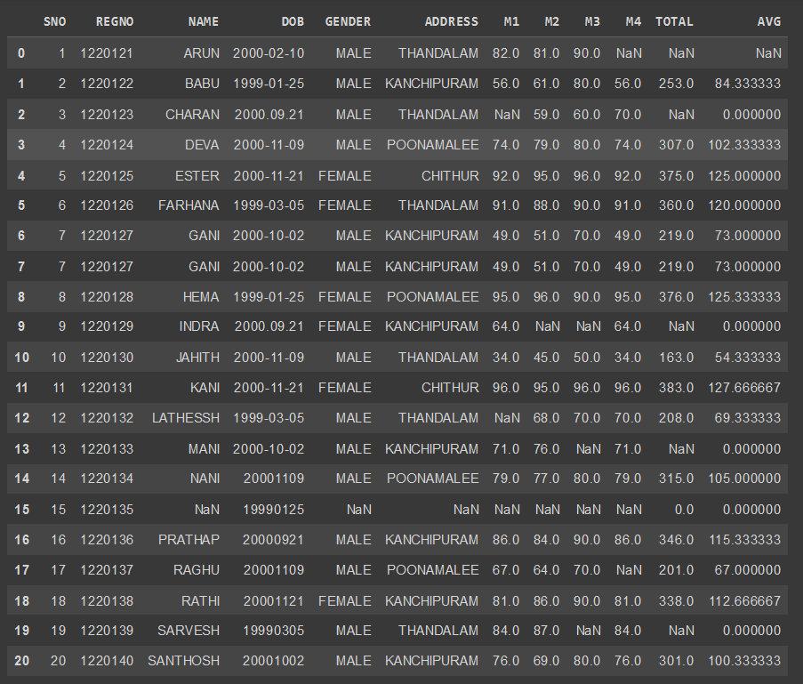

## 2) Display head
```py
df.head()
```
## OUTPUT:
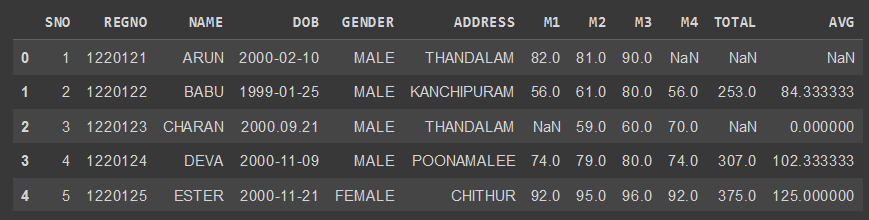

## 3) Display tail
```py
df.tail()
```
## OUTPUT:
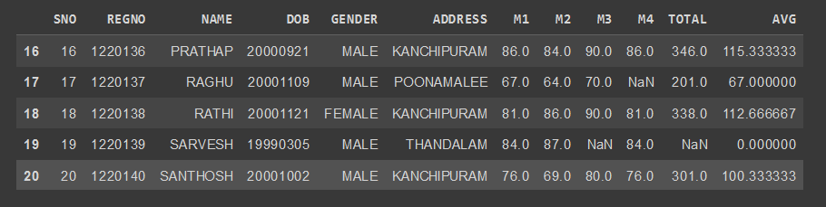

## 4) Info of dataframe
```py
df.info()
```
## OUTPUT:
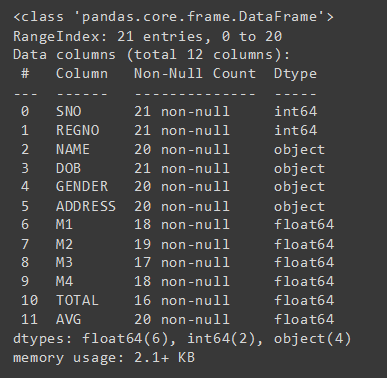

## 5) Describe about the dataframe
```py
df.describe()
```
## OUTPUT:
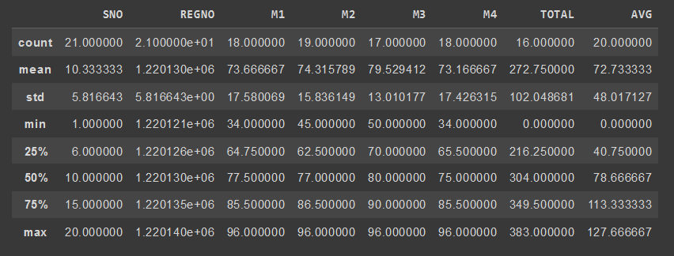

## 6) Shape of the dataframe
```py
df.shape
```
## OUTPUT:
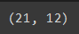

## 7) Checking tha NUll values
```py
df.isnull().sum()
```
## OUTPUT:
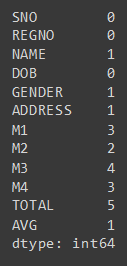

## 8) Drop the Null values
```py
x=df.dropna(how='any')
x
```
## OUTPUT:
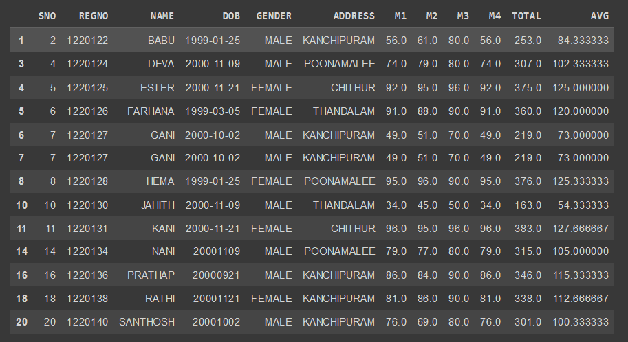

## 9) Drop the Null values in Total
```py
tot=df.dropna(subset=['TOTAL'],how='any')
tot
```
## OUTPUT:
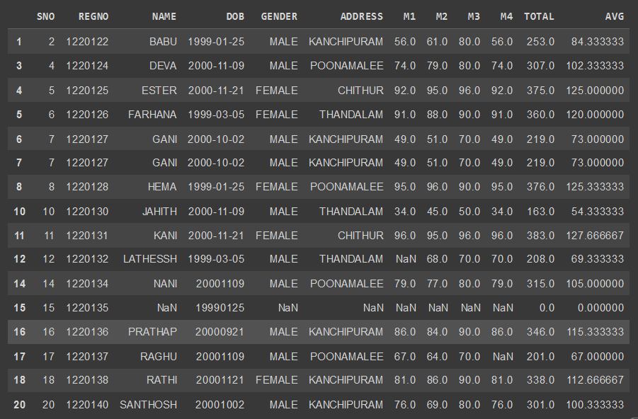

## 10) FIll the Null values
```py
df.fillna(0)
```
## OUTPUT:
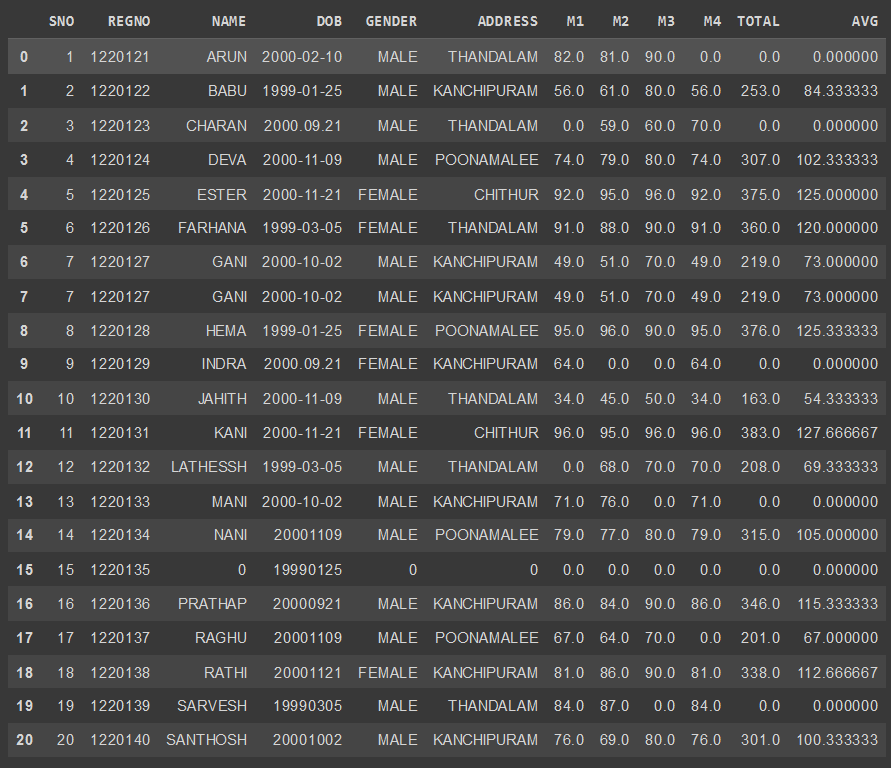

## 11) Finding the mean value
```py
mn=df.TOTAL.mean()
mn
```
## OUTPUT:
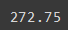

## 12) Final output
```py
for x in df.index:
  if df.loc[x,"AVG"]>100:
    df.drop(x,inplace=True)
df
```
## OUTPUT:
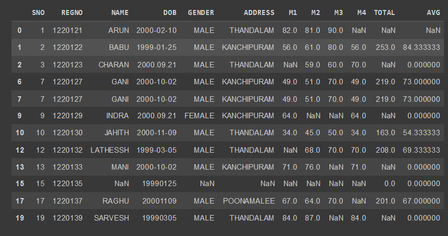

## 14) Outlier detection and removal
```Python
import pandas as pd
import seaborn as sns
age=[1,3,28,27,25,92,30,39,40,50,26,24,29,94]
dff=pd.DataFrame(age)
dff
```
              
## OUTPUT:

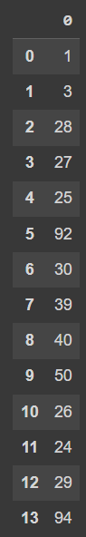
## 15) Boxplot
```Python
dsf=sns.boxplot(dff)
```
     
## OUTPUT:

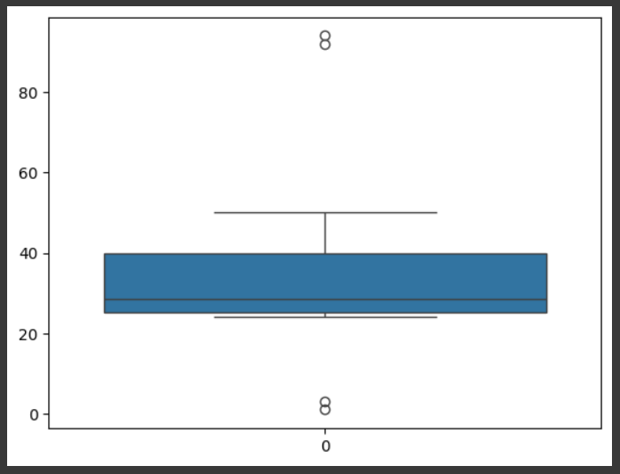


## 16) Scatterplot
```Python
dsf=sns.scatterplot(dff)
```
   ## OUTPUT:

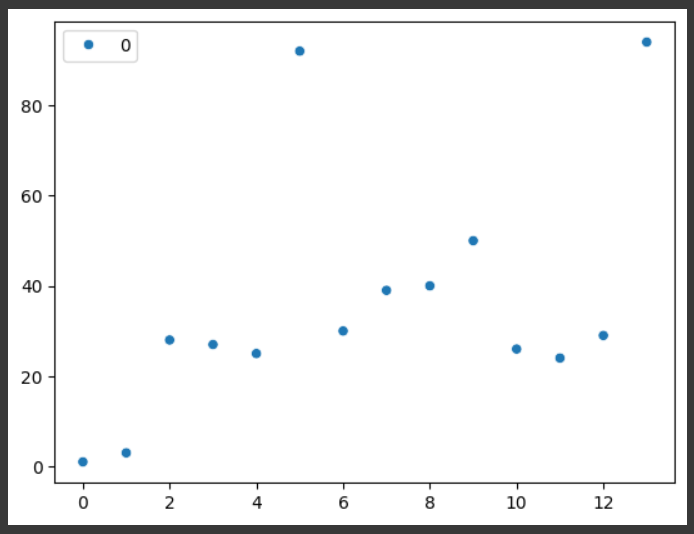


## 17) IQR
```Python
q1=dff.quantile(0.25)
q2=dff.quantile(0.5)
q3=dff.quantile(0.75)
iqr=q3-q1
iqr
```

              
## OUTPUT:

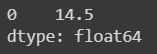

    
## 18) Checking the high and low value
```Python
low=q1-1.5*iqr
low
high=q3+1.5*iqr
high
```
## OUTPUT:

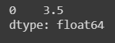

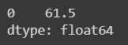
    
## 19) Filtering outlier value
```Python
dff=dff[((dff>=low)&(dff<=high))]
dff
```
     
## OUTPUT:

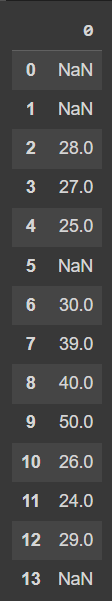
    
## 20) Dropping the null value
```Python
dff.dropna()
```

              
## OUTPUT:

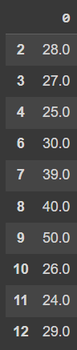
## 21) Box plotting after filtering outlier
```Python
sns.boxplot(data=dff)
```
     
## OUTPUT:

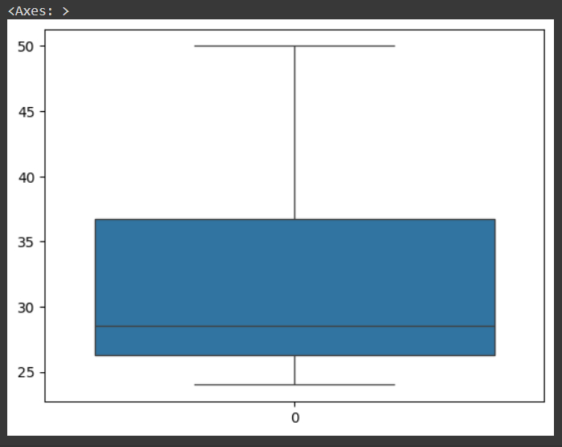

  
## 22) Z Score
```Python
import pandas as pd
import seaborn as sns
import numpy as np
from scipy import stats
data={'weight':[12,15,18,21, 24, 27, 30, 33, 36, 39, 42, 45, 48, 51, 54, 57,60,63,66,69,202,72, 75, 78, 81, 84, 232, 87, 90, 93,96,99,258]}
ds=pd.DataFrame(data)
ds
```
 
## OUTPUT:

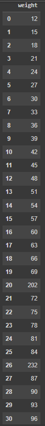
## 23) Z Score
```Python
import pandas as pd
import seaborn as sns
import numpy as np
from scipy import stats
data={'weight':[12,15,18,21, 24, 27, 30, 33, 36, 39, 42, 45, 48, 51, 54, 57,60,63,66,69,202,72, 75, 78, 81, 84, 232, 87, 90, 93,96,99,258]}
ds=pd.DataFrame(data)
ds
```

## OUTPUT:


    
## 24) Z Score
```Python
sns.boxplot(data=ds)
```

              
## OUTPUT:
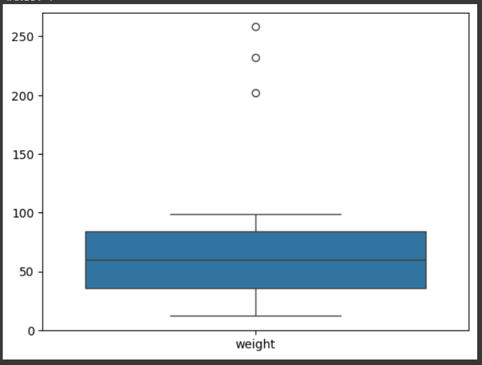
    
 ## 25) Z Score
```Python
z=np.abs(stats.zscore(ds))
z
```
   
## OUTPUT:
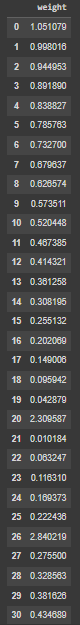

## 26)Z score 
```Python
print(ds[z['weight']>3])
```


## OUTPUT:
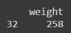

## Result
Hence the data was cleaned , outliers were detected and removed.


